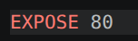

# SentCTF 2026

This the publicly shared Github repository for the SentCTF 2026 event hosted by NTU Sentinels. Each challenge folders are structured as follows:

- `dist`
  - files distributed in the CTF site
- `service`
  - service files for hosted servers
  - contains both `Dockerfile`, and `docker-compose.yml` files to setup the local environment for **web** challenges (refer below to setup the Docker environment)
  - other categories: pwn, rev, etc. can be solved using the provided binary/artefact files locally without setting up any Docker environments
- `solve`
  - challenge writeup for reference

## Setting up local Docker environment

> Run these commands from the same directory as the `Dockerfile` (**service** folder)

```shell
docker compose up
```

You can identify the port number by reading the `EXPOSE` value in the Dockerfile


