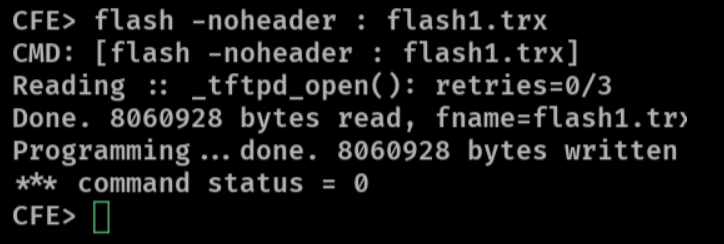

# TheMoon

> Challenge name inspired by the notorious "TheMoon" botnet

## Category

IoT

## Author

Jarrettgxz

## Difficulty

5/5

## Equipments to bring on the actual day

- 2-3 network ethernet cables
- 2 power supply cables
- 2-3 physical Linksys E1200 routers (flashed with modified firmware)
- 3 jumper wires (to connect to UART)
- Modified firmware ready on laptop's VM
  - \*\*prepare notes on commands to flash via CFE console

## TO flash firmware on router (using CFE console)

> In the event that that router firmware is corrupted that day

1. Get a debug console on the router

- connect jumper wires + UART-USB adapter between machine and router
- run `picocom` to catch a console shell

2. Power on the router

- immediately enter CTRL+C repeatedly to interrupt boot process, and drop into a (recovery) CFE console

```shell
CFE>
```

3. Run a TFTP server

```shell
CFE> flash -noheader : flash1.trx # start tftpd server
```

- this server will retrieve a firmware file and flash it onto the physical flash memory

4. Use a TFTP client to send the firmware file to the router (TFTP server)
   > this command should be performed on the machine connected to the router via the UART connection

```sh
# immediately send else CFE will timeout
$ tftp ROUTER-IP -m binary -c put FIRMWARE-FILE

# eg.
$ tftp 192.168.1.1 -m binary -c put FIRMWARE.bin
```



## Challenge Summary

Players receives a modified firmware file from a _Linksys E1200 router_. They will be required to reverse it, analyse the filesystem and relevant source codes, identify the **command injection** vulnerability, craft an exploit to achive RCE, get a shell.

## Player Description

> take note of the attached cheatsheet

You have gained access to a firmware file from the _Linksys E1200 router_ that contains real vulnerabilities, and have been used in a real-world botnet campaign. Extract the filesystem, investigate the files, find the unauthenticated **command injection** vulnerability within, craft an exploit to achieve RCE and a shell.

When you are ready with your exploit, head over to the mission room challenge (...) to run it on the physical device and retrieve the flag!

**NOTE**: you can test your exploit locally using firmware emulation (refer to the notes in the downloadable cheatsheet)

Provided materials:

- Dockerfile (to setup required tools)
- Firmware file from the router device
- Commands cheatsheet

Flag format: `sentctf{...}`

## Player Files

- `dist/Dockerfile`
- `dist/linksys_e1200.bin`
- `dist/cheatsheet.pdf`

## Flag

`sentctf{th3_m0on_botn4t}`

`
