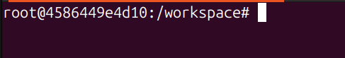
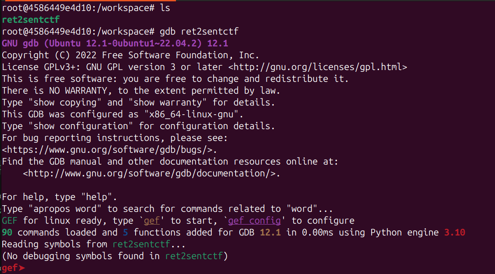

## Setup the required tools

The provided commands builds the following required tools:

1. **gdb-gef** (enhanced version of gdb)

- uses the same basic commands as the `gdb` tool, with additional ones (refer to cheatsheet)

2. **pwntools** (Python library)

- eg. `pwn cyclic ...`

> Ensure that you are running these commands from the same directory as the `Dockerfile` file

```shell
docker build -t pwn-tools .

docker run -it --cap-add=SYS_PTRACE --security-opt seccomp=unconfined pwn-tools
```

You will be provided with a terminal environment that looks similar to this:

- the `ret2sentctf` binary will be available
- you may directly run `gdb` on it



